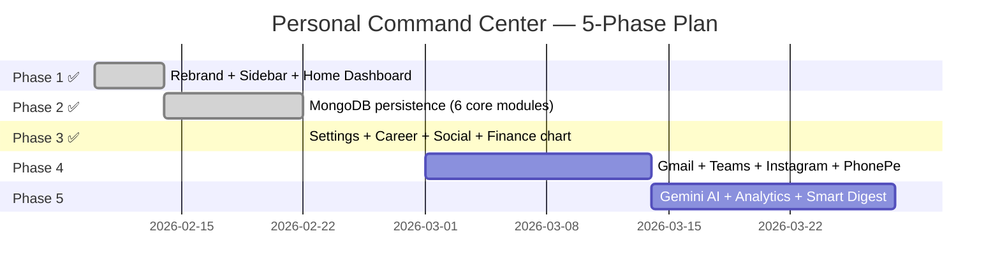

# 📋 Business Requirements Document (BRD)
## Harsh's Personal Command Center

> **Version:** 3.1 — Voice Capture Upgrade
> **Date:** 26 February 2026
> **Author:** Harsh Sahu | **Status:** 🟢 Active Development

---

## 1. Executive Summary

**Harsh's Personal Command Center** is a private, self-hosted, single-user life operating system built on React + Vite (frontend) and Node.js + Express + MongoDB (backend). It unifies tasks, finances, health, knowledge, goals, career tracking, and social relationships into a single premium dashboard — eliminating the need to context-switch between 5+ apps daily.

**Transformation Path:** Rebrand from Sorigin AMS (enterprise SaaS) → Personal Life OS across 3 phases:
- **Phase 1** — Rebrand, sidebar redesign, Home dashboard
- **Phase 2** — Real data persistence (MongoDB) for 6 core modules
- **Phase 3** — Settings, Career Hub, Social Life Tracker, Finance chart, Data Export ✅

---

## 2. Vision & Goals

| Goal | Description |
|---|---|
| **Single source of truth** | One app replacing 5+ tools (Notion, Excel, MHW, LinkedIn, etc.) |
| **Privacy first** | All data local; MongoDB on own machine; no cloud unless user-initiated |
| **Frictionless capture** | Add any thought in < 5 seconds from any module |
| **Life analytics** | Spot patterns: habits ↔ productivity ↔ finance correlation |
| **AI-powered** | Context-aware AI chat that knows your tasks, goals, finances |
| **Everything connected** | Tasks surface in calendar; captures link to goals; finance charts to goals |

---

## 3. Stakeholders

| Role | Person | Responsibility |
|---|---|---|
| Product Owner | Harsh Sahu | Requirements, approvals, UX decisions |
| Developer | Harsh Sahu + AI Agent | Full-stack implementation |
| End User | Harsh Sahu | Sole private user |

---

## 4. Scope

### ✅ In Scope (Phases 1–3 — Complete)
- Home Dashboard with real-time MongoDB stats
- Quick Capture (7 types, MongoDB)
- Task Manager (CRUD, today/week/someday)
- Finance Tracker (transactions + budget + monthly chart)
- Knowledge Base (notes, books, articles)
- Goals Tracker (milestones + progress)
- Health & Habits (daily log, streak)
- Career Hub (jobs, certs, skills, profile — localStorage)
- Social Life Tracker (contacts CRM, content ideas, platform stats — localStorage)
- Settings (profile, theme, notifications, API key, data export)
- AI Chat (UI ready, API key wired)
- AI Voice Capture (pause/resume, mic meter, transcript draft recovery, AI refine)
- JWT Auth (sign in / sign up / reset password)
- Backend data export (`GET /api/v1/personal/export`)

### ⏳ Out of Scope (Phases 4–5)
- Gmail / Microsoft Teams calendar sync
- Instagram Graph API live follower/engagement pull
- PhonePe UPI CSV transaction import
- LinkedIn profile live pull
- AI context (Gemini with full app data)
- WhatsApp Business API reminders
- Cross-module analytics dashboard

---

## 5. Functional Requirements

### 5.1 Home Dashboard
| ID | Requirement |
|---|---|
| FR-01 | Greeting with current time, date, day |
| FR-02 | Today's #1 Focus with progress bar |
| FR-03 | Real-time stats cards (Tasks Today, Habit Streak, Captured Today, Goals on Track) from MongoDB |
| FR-04 | Quick Capture bar — submit without leaving Home |
| FR-05 | Today's Schedule section (calendar events) |
| FR-06 | Today's Habits mini-tracker |
| FR-07 | Recent Captures list (last 5 from MongoDB) |
| FR-08 | Quick Access grid (8 module shortcuts) |

### 5.2 Quick Capture
| ID | Requirement |
|---|---|
| FR-09 | 7 capture types: Idea, Task, Article, Follow-up, Money, Urgent, Journal |
| FR-10 | List captures in reverse chronological order |
| FR-11 | Delete individual captures |
| FR-12 | Filter by type |
| FR-13 | MongoDB persistence scoped to userId |
| FR-66 | Voice Capture modal supports start/pause/resume/stop flows |
| FR-67 | Live transcript with interim + final speech segments |
| FR-68 | Audio input meter with elapsed duration + word count |
| FR-69 | Transcript auto-draft recovery from localStorage on reopen |
| FR-70 | Raw transcript auto-saved to Capture before AI refine |
| FR-71 | One-click AI refine updates saved capture while preserving raw text |
| FR-72 | Language selector for speech recognition (US/IN English + Hindi) |

### 5.3 Task Manager
| ID | Requirement |
|---|---|
| FR-14 | Add tasks: title, priority (high/medium/low), life area, tab (today/week/someday) |
| FR-15 | Toggle done/undone |
| FR-16 | Delete tasks |
| FR-17 | View tasks filtered by tab |
| FR-18 | MongoDB persistence |

### 5.4 Finance Tracker
| ID | Requirement |
|---|---|
| FR-19 | Log income/expense with amount, category, description, date |
| FR-20 | Balance card (income − expenses) |
| FR-21 | Budget progress bars (4 categories with limits) |
| FR-22 | Monthly income vs expense bar chart (last 6 months, pure CSS) |
| FR-23 | Delete transactions |
| FR-24 | MongoDB persistence |

### 5.5 Knowledge Base
| ID | Requirement |
|---|---|
| FR-25 | Create notes: title, type (Note/Article/Book/Course), tags, content, emoji |
| FR-26 | Edit and delete notes |
| FR-27 | Filter by type |
| FR-28 | MongoDB persistence |

### 5.6 Goals Tracker
| ID | Requirement |
|---|---|
| FR-29 | Create goals with area (Career/Health/Finance/Learning/Fun/Relationships) |
| FR-30 | Add milestones (checklist subdocuments) |
| FR-31 | Update progress 0–100% with slider |
| FR-32 | Delete goals |
| FR-33 | MongoDB persistence |

### 5.7 Health & Habits
| ID | Requirement |
|---|---|
| FR-34 | Daily habit tracker: water, sleep, exercise, meditation, reading, journalling |
| FR-35 | Mood selector (5 emoji states) |
| FR-36 | Sleep hours + quality |
| FR-37 | Auto-save on every change (800ms debounce) |
| FR-38 | One document per user per date (upsert) in MongoDB |

### 5.8 Career Hub
| ID | Requirement |
|---|---|
| FR-39 | Add/delete job applications (company, role, status, date, notes) |
| FR-40 | Job statuses: Applied / Interview / Offer / Rejected / Active |
| FR-41 | Add/delete certifications (name, issuer, dates, emoji, status) |
| FR-42 | Add/delete skills; edit skill level with hover slider |
| FR-43 | Professional profile: experience, current role, LinkedIn URL, Naukri URL |
| FR-44 | All data in localStorage (instant, no network dependency) |

### 5.9 Social Life Tracker
| ID | Requirement |
|---|---|
| FR-45 | Add/delete contacts (name, relationship type, last-talked date, phone, note) |
| FR-46 | Relationship types: Friend / Family / Colleague / Professional / Mentor / Other |
| FR-47 | Filter contacts by since-last-talked: 7d+ / 14d+ / 30d+ |
| FR-48 | Overdue badge (red/amber) for contacts not spoken to in 14+ days |
| FR-49 | ✓ "Talked today" one-click button resets last-talked date |
| FR-50 | Add/delete content ideas per platform |
| FR-51 | Manual social stats editor (Instagram, LinkedIn: followers, engagement, last post) |
| FR-52 | All data in localStorage |

### 5.10 Settings
| ID | Requirement |
|---|---|
| FR-53 | Edit display name, bio, timezone |
| FR-54 | Theme picker: Light / Dark / System |
| FR-55 | Notification preference toggles × 4 |
| FR-56 | Gemini API key input with show/hide toggle |
| FR-57 | "Export My Data" → downloads all MongoDB data as JSON |
| FR-58 | Sign Out button |
| FR-59 | Preferences persisted in `localStorage['harsh_settings']` |

### 5.11 Authentication
| ID | Requirement |
|---|---|
| FR-60 | Sign In: email + password → JWT |
| FR-61 | Sign Up: name, email, password |
| FR-62 | JWT stored as `localStorage['accessToken']` |
| FR-63 | Refresh token support |
| FR-64 | Reset password via email link |
| FR-65 | All `/api/v1/personal/*` routes JWT-protected |

---

## 6. Non-Functional Requirements

| Category | Requirement |
|---|---|
| **Privacy** | All data local — no external cloud unless user-initiated |
| **Performance** | Page load < 2s; API response < 300ms on local |
| **Security** | JWT on all personal APIs; bcrypt passwords; userId-scoped DB queries |
| **Reliability** | Graceful error handling on all API calls; React error boundaries |
| **Browser Compatibility** | Voice capture gracefully degrades when Web Speech API is unavailable |
| **Maintainability** | TypeScript strict; component-based; unified API service layer |
| **Scalability** | Single-user design; optimised for one userId |

---

## 7. Technology Stack

| Layer | Technology | Purpose |
|---|---|---|
| Frontend | React 18 + TypeScript 5 | UI + type safety |
| Frontend | Vite 5 | Dev server + build |
| Frontend | TailwindCSS 3 | Utility-first styling |
| Frontend | React Router 6 | Client-side routing |
| Frontend | Axios | HTTP client with interceptors |
| Backend | Node.js 20 + Express 4 | HTTP API server |
| Backend | Mongoose 8 | MongoDB ODM |
| Backend | jsonwebtoken | JWT auth |
| Backend | bcryptjs | Password hashing |
| Database | MongoDB 7 (local) | Document store |
| DB Name | `harsh_personal` | Primary database |

---

## 8. Full Project File Structure

```
PERSONAL ASSISTANCE (HARSH )/
│
├── 📄 package.json               Frontend npm config
├── 📄 vite.config.ts             Vite build + proxy settings
├── 📄 tsconfig.json              TypeScript root config
├── 📄 tsconfig.app.json          TypeScript app target
├── 📄 tsconfig.node.json         TypeScript node target
├── 📄 tailwind.config.js         TailwindCSS theme config
├── 📄 postcss.config.js          PostCSS pipeline
├── 📄 eslint.config.js           ESLint rules
├── 📄 .env                       Frontend env vars (VITE_API_URL)
├── 📄 BRD.md                     This document
├── 📄 PERSONAL_ASSISTANT_PLAN.md Phase plan & vision
├── 📄 DASHBOARD_IMPLEMENTATION.md Dashboard design notes
│
├── 📁 backend/                   Node.js + Express backend
│   ├── 📄 server.js              App entry — mounts all routes + CORS
│   ├── 📄 package.json           Backend dependencies
│   ├── 📄 .env                   PORT + MONGODB_URI + JWT_SECRET
│   ├── 📄 seed-harsh.js          Seeds Harsh user account (run once)
│   ├── 📄 seeder.js              General data seeder utility
│   │
│   ├── 📁 middleware/
│   │   ├── auth.js               JWT verification (protect middleware)
│   │   └── logger.js             HTTP request logger
│   │
│   ├── 📁 models/                Mongoose schemas
│   │   ├── User.js               User (name, email, password hashed)
│   │   ├── Capture.js            Quick capture (type, text, emoji)
│   │   ├── Task.js               Personal tasks (title, priority, tab, done)
│   │   ├── Finance.js            Transactions (type, amount, category, date)
│   │   ├── Knowledge.js          Notes (title, type, tags, content)
│   │   ├── Goal.js               Goals (area, progress, milestones[])
│   │   ├── Health.js             Daily health log (habits, mood, sleep)
│   │   ├── Ticket.js             Legacy support ticket model
│   │   ├── SolarDaily.js         Legacy solar tracking model
│   │   └── Log.js                System request logs
│   │
│   ├── 📁 controllers/
│   │   ├── auth.js               register, login, refresh, forgotPw, resetPw
│   │   ├── personal.js           All 6 module CRUD + getDashboardStats + exportAllData
│   │   ├── tickets.js            Legacy ticket CRUD
│   │   └── solar.js              Legacy solar data
│   │
│   └── 📁 routes/
│       ├── auth.js               POST /api/v1/auth/*
│       ├── personal.js           GET|POST|PUT|PATCH|DELETE /api/v1/personal/*
│       ├── tickets.js            /api/v1/tickets/*
│       └── solar.js              /api/v1/solar/*
│
└── 📁 src/                       React frontend
    ├── 📄 main.tsx               React DOM entry
    ├── 📄 App.tsx                Root router (all protected + auth routes)
    ├── 📄 index.css              Global CSS + Tailwind base
    ├── 📄 vite-env.d.ts          Vite type declarations
    ├── 📄 svg.d.ts               SVG import types
    │
    ├── 📁 api/
    │   ├── axios.ts              Axios instance (baseURL + auth interceptor)
    │   └── tickets.api.ts        Legacy ticket API calls
    │
    ├── 📁 context/
    │   ├── AuthContext.tsx       JWT state — login, logout, token refresh
    │   └── SidebarContext.tsx    Sidebar expanded/hovered/mobile state
    │
    ├── 📁 layout/
    │   ├── AppLayout.tsx         Main layout wrapper (sidebar + header + <Outlet />)
    │   ├── AppHeader.tsx         Top navigation bar with search + user menu
    │   └── Backdrop.tsx          Mobile sidebar backdrop overlay
    │
    ├── 📁 pages/                 Route-level page components
    │   ├── 📁 Dashboard/
    │   │   └── Home.tsx          Home dashboard (stats, captures, habits, schedule)
    │   ├── 📁 AuthPages/
    │   │   ├── AuthPageLayout.tsx Auth page wrapper
    │   │   ├── SignIn.tsx         Login page
    │   │   └── SignUp.tsx         Registration page
    │   ├── 📁 OtherPage/
    │   │   └── NotFound.tsx       404 Not Found page
    │   ├── CapturePage.tsx        Quick Capture — MongoDB CRUD + type filter
    │   ├── PersonalTasksPage.tsx  Task Manager — MongoDB CRUD (today/week/someday tabs)
    │   ├── FinancePage.tsx        Finance Tracker — MongoDB CRUD + budget + monthly chart
    │   ├── KnowledgePage.tsx      Knowledge Base — MongoDB CRUD + type filter
    │   ├── GoalsPage.tsx          Goals Tracker — MongoDB CRUD + milestones
    │   ├── HealthPage.tsx         Health & Habits — MongoDB auto-save (debounced)
    │   ├── CareerPage.tsx         Career Hub — localStorage (Jobs/Certs/Skills/Profile)
    │   ├── SocialPage.tsx         Social Life — localStorage (Contacts/Ideas/Platforms)
    │   ├── SettingsPage.tsx       Settings — localStorage (profile/theme/notif/key/export)
    │   ├── AiChatPage.tsx         AI Chat page (multi-conversation shell)
    │   └── Calendar.tsx           Personal calendar view
    │
    ├── 📁 services/              API service layer
    │   ├── authService.ts         Auth API + token management (key: 'accessToken')
    │   ├── personalApi.ts         Unified API client for all 6 MongoDB modules + stats
    │   ├── roleService.ts         Stub (legacy compatibility)
    │   └── userService.ts         Stub (legacy compatibility)
    │
    ├── 📁 components/
    │   ├── PersonalSidebar.tsx    Sidebar — 12 nav items + SYSTEM section (Settings)
    │   ├── AuthRedirect.tsx       OAuth redirect handler
    │   ├── ProtectedRoute.tsx     Route guard — checks accessToken
    │   ├── ScrollToTopButton.tsx  Floating scroll-to-top helper
    │   │
    │   ├── 📁 auth/
    │   │   ├── SignInFormNew.tsx   Sign in form
    │   │   ├── SignUpFormNew.tsx   Sign up form
    │   │   ├── ForgotPasswordModal.tsx  Forgot password modal
    │   │   ├── ResetPasswordPage.tsx    Password reset page
    │   │   └── SetPasswordPage.tsx      New password set page
    │   │
    │   ├── 📁 chat/              AI Chat UI components
    │   │   ├── ChatWidget.tsx     Floating global chat widget
    │   │   ├── ChatContainer.tsx  Conversation message area
    │   │   ├── ChatHeader.tsx     Chat header bar
    │   │   ├── ConversationItem.tsx   Single conversation row
    │   │   ├── ConversationList.tsx   Conversation list sidebar
    │   │   ├── MessageBubble.tsx  Individual message bubble
    │   │   ├── MessageInput.tsx   Compose + send input
    │   │   ├── NewConversationModal.tsx  Start new chat modal
    │   │   ├── ReadReceipt.tsx    Read/delivered indicator
    │   │   ├── TypingIndicator.tsx   "..." animation
    │   │   ├── UserItem.tsx       User list row
    │   │   ├── UserSearchList.tsx User search panel
    │   │   └── index.ts           Barrel exports
    │   │
    │   ├── 📁 charts/
    │   │   ├── bar/BarChartOne.tsx   Reusable bar chart
    │   │   └── line/LineChartOne.tsx Reusable line chart
    │   │
    │   ├── 📁 header/
    │   │   ├── Header.tsx           App header shell
    │   │   ├── HeaderSearch.tsx     Global search
    │   │   ├── NotificationDropdown.tsx  Bell + notifications
    │   │   └── UserDropdown.tsx     Avatar + user menu
    │   │
    │   ├── 📁 form/              Reusable form primitives
    │   │   ├── Form.tsx           Form wrapper
    │   │   ├── Label.tsx          Form label
    │   │   ├── MultiSelect.tsx    Multi-select input
    │   │   ├── date-picker.tsx    Date picker
    │   │   ├── input/             InputField, Checkbox, Radio, FileInput, TextArea, RadioSm
    │   │   ├── switch/Switch.tsx   Toggle switch
    │   │   └── form-elements/     CheckboxComponents, ToggleSwitch, DropZone, SelectInputs, …
    │   │
    │   ├── 📁 ui/                Generic UI primitives
    │   │   ├── ErrorBoundary.tsx   React error boundary
    │   │   ├── LoadingSpinner.tsx  Animated spinner
    │   │   ├── FloatingFilterButton.tsx  Floating action button
    │   │   ├── DynamicIcon.tsx     Icon resolver
    │   │   ├── ChatBot.tsx         ChatBot widget
    │   │   ├── alert/Alert.tsx     Alert banner
    │   │   ├── avatar/Avatar.tsx   User avatar
    │   │   ├── badge/Badge.tsx     Status badge pill
    │   │   ├── button/Button.tsx   Primary button
    │   │   ├── card/Card.tsx       Card container
    │   │   ├── dropdown/           Dropdown + DropdownItem
    │   │   ├── input/Input.tsx     Base input
    │   │   ├── modal/index.tsx     Modal dialog
    │   │   ├── select/Select.tsx   Select dropdown
    │   │   ├── table/index.tsx     Data table
    │   │   ├── images/            ResponsiveImage, TwoColumnGrid, ThreeColumnGrid
    │   │   └── videos/            AspectRatioVideo + ratio variants
    │   │
    │   └── 📁 gis/
    │       └── InteractiveMap.tsx   Map component (legacy)
    │
    ├── 📁 features/              Feature modules (legacy, stub-wired)
    │   ├── roles/                 Role management stubs
    │   └── user/                  User management stubs
    │
    ├── 📁 types/                 TypeScript type definitions
    │   ├── user.ts                User types
    │   ├── ticket.types.ts        Ticket types
    │   ├── chat.types.ts          Chat message types
    │   ├── role.ts                Role types
    │   ├── common.ts              Shared types
    │   ├── checklist.ts           Checklist types
    │   ├── checkpoint.ts          Checkpoint types
    │   ├── asset.ts               Asset types (legacy)
    │   ├── equipment.ts           Equipment types (legacy)
    │   ├── feature.ts             Feature flag types
    │   └── projectType.ts         Project types
    │
    └── 📁 utils/                 Utility helpers
        ├── constants.ts           App-wide constants
        ├── dateUtils.ts           Date formatting helpers
        ├── navigationUtils.ts     Route navigation helpers
        ├── cacheUtils.ts          localStorage cache utilities
        ├── roleUtils.ts           Role checking helpers
        ├── ticketUtils.ts         Ticket status/colour helpers
        └── sessionDebugger.ts     JWT session debug util
```

---

## 9. API Reference

### Auth Routes — `/api/v1/auth`

| Method | Endpoint | Auth | Description |
|---|---|---|---|
| POST | `/auth/register` | Public | Create account |
| POST | `/auth/login` | Public | Login → JWT |
| POST | `/auth/refresh` | Public | Refresh access token |
| POST | `/auth/forgot-password` | Public | Send reset email |
| POST | `/auth/reset-password` | Public | Set new password |

### Personal Modules — `/api/v1/personal` 🔒 JWT Required

| Method | Endpoint | Description |
|---|---|---|
| GET / POST | `/captures` | List all / create capture |
| DELETE | `/captures/:id` | Delete capture |
| GET / POST | `/tasks` | List all / create task |
| PATCH / DELETE | `/tasks/:id` | Toggle done / delete task |
| GET / POST | `/finance` | List all / add transaction |
| DELETE | `/finance/:id` | Delete transaction |
| GET / POST | `/knowledge` | List all / create note |
| PUT / DELETE | `/knowledge/:id` | Edit / delete note |
| GET / POST | `/goals` | List all / create goal |
| PUT / DELETE | `/goals/:id` | Update / delete goal |
| GET | `/health/:date` | Get health log for date |
| PUT | `/health/:date` | Save / upsert health log |
| GET | `/stats` | Dashboard stats aggregate |
| GET | `/export` | Export all data as JSON download |

---

## 10. Data Models

```
User        { name, email, password*, role, createdAt }
Capture     { userId, type, text, emoji, createdAt }
Task        { userId, title, priority, area, tab, done, dueDate }
Finance     { userId, type, amount, category, note, date, emoji }
Knowledge   { userId, title, type, content, tags[], emoji }
Goal        { userId, title, area, emoji, progress, deadline,
              milestones[{ text, done }] }
Health      { userId, date★, habits{6 bools}, mood, sleepHrs,
              sleepQuality }          ★ unique index per userId+date
```

---

## 11. Security Model

| Layer | Mechanism |
|---|---|
| **Passwords** | bcryptjs hash + salt |
| **Auth tokens** | JWT (HS256), 30d expiry, signed with `JWT_SECRET` |
| **Frontend storage** | `localStorage['accessToken']` |
| **API header** | `Authorization: Bearer <token>` |
| **Data isolation** | Every DB query: `{ userId: req.user._id }` |
| **CORS** | Allowlist frontend origin in `server.js` |

---

## 12. localStorage Key Map

| Key | Owned By | Contents |
|---|---|---|
| `accessToken` | Auth | JWT access token |
| `refreshToken` | Auth | JWT refresh token |
| `harsh_settings` | Settings | name, bio, timezone, theme, notifications, geminiKey |
| `career_jobs` | Career | Job applications `Job[]` |
| `career_certs` | Career | Certifications `Cert[]` |
| `career_skills` | Career | Skills + levels `Skill[]` |
| `career_profile` | Career | Experience, role, LinkedIn, Naukri URLs |
| `social_contacts` | Social | Contacts CRM `Contact[]` |
| `social_ideas` | Social | Content ideas `ContentIdea[]` |
| `social_stats` | Social | Platform stats (followers, engagement, lastPost) |

---

## 13. Implementation Roadmap



### Phase 4 — External Integrations
| Integration | What it enables |
|---|---|
| Gmail OAuth2 | Import calendar events, parse task emails |
| MS Teams | Sync meeting invites to Calendar |
| Instagram Graph API | Live followers, engagement, post schedule |
| PhonePe UPI CSV | Auto-import & categorise transactions |
| LinkedIn API | Pull profile views, connection count |

### Phase 5 — AI & Intelligence
| Feature | Description |
|---|---|
| **AI Chat** | Gemini with full app context (tasks, goals, captures) |
| **Smart digest** | Weekly AI summary across all modules |
| **Cross analytics** | Health ↔ productivity ↔ finance correlation charts |
| **Auto-journal** | AI drafts daily journal from your day's activity |
| **Scheduled export** | Auto JSON backup daily to local folder |

---

## 14. Environment Variables

### Frontend `.env`
```env
VITE_API_URL=http://localhost:5001/api/v1
```

### Backend `backend/.env`
```env
PORT=5001
MONGODB_URI=mongodb://127.0.0.1:27017/harsh_personal
JWT_SECRET=your_super_secret_here
NODE_ENV=development
```

---

## 15. Local Development Setup

```bash
# 1. Start MongoDB
mongod --dbpath /usr/local/var/mongodb

# 2. Backend
cd "PERSONAL ASSISTANCE (HARSH )/backend"
npm install
npm run dev          # → http://localhost:5001

# 3. Frontend
cd ..
npm install
npm run dev          # → http://localhost:5173

# 4. Seed account (first time only)
cd backend && node seed-harsh.js
```

**Login:** `harsh@personal.app` / `Harsh@123`
